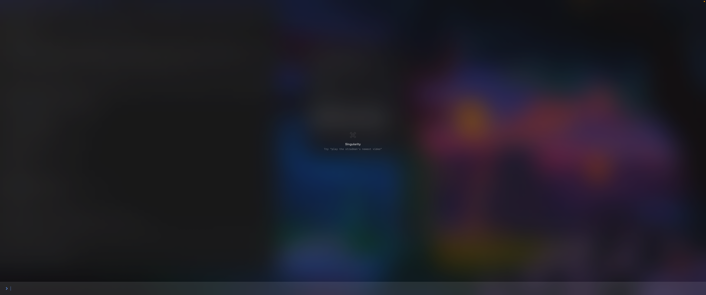
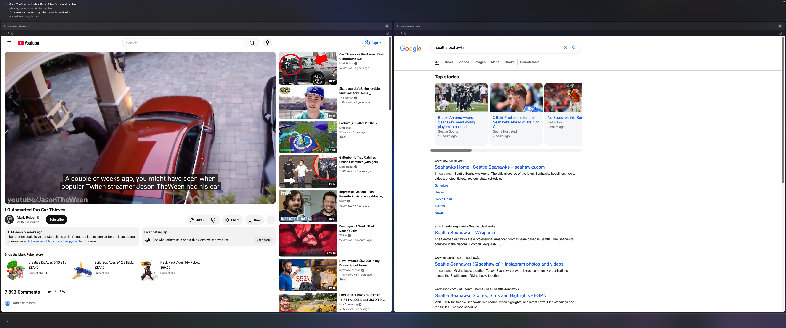
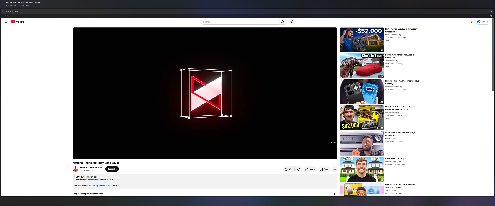
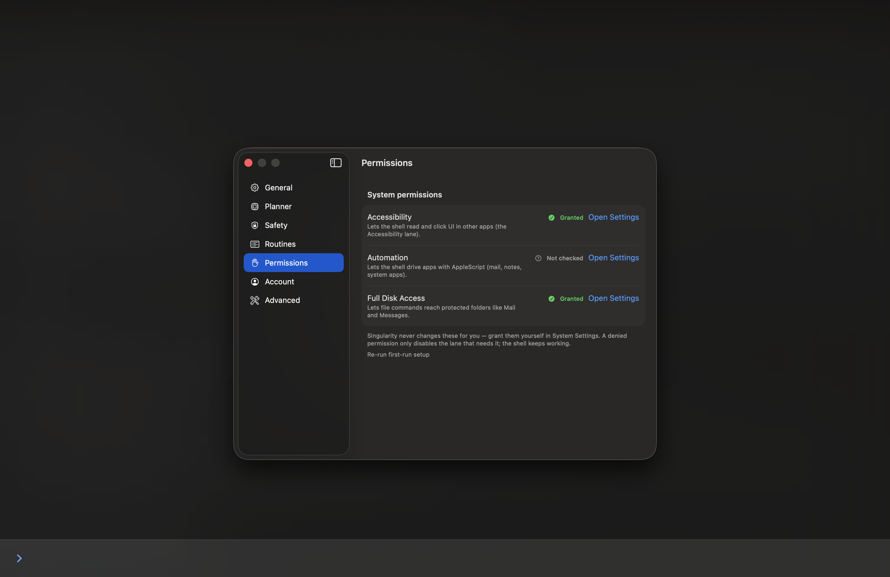

# Singularity

> A fullscreen AI command shell for macOS. Press one hotkey, type what you want in plain English, and your Mac does it: opening apps, playing content, driving websites, reading and sending mail, running files. Intent is parsed by a local language model and carried out through a five-lane executor. No cloud, no chatbot, no clicking around.

<p align="center">
  
  
  
  
  
  
  
</p>

---

## Table of Contents

- [Screenshots](#screenshots)
- [The Problem](#the-problem)
- [What Singularity Does](#what-singularity-does)
- [The Five Lanes](#the-five-lanes)
- [Features](#features)
- [Engineering Highlights](#engineering-highlights)
- [Architecture](#architecture)
- [Getting Started](#getting-started)
- [Using It](#using-it)
- [The Safety Pipeline](#the-safety-pipeline)
- [Running the Tests](#running-the-tests)
- [Project Layout](#project-layout)
- [Privacy](#privacy)
- [For Contributors](#for-contributors)
- [Troubleshooting](#troubleshooting)
- [Disclaimer](#disclaimer)
- [License](#license)

---

## Screenshots

<!--
  Placeholders below render immediately so the repo looks finished.
  To use real screenshots: drop PNGs into docs/screenshots/ and swap each
  src to the local path, for example src="docs/screenshots/shell.png".
  Capture guidance lives in docs/screenshots/README.md.
-->
<p align="center">
  
  
</p>
<p align="center">
  
  
</p>

<p align="center"><em>The fullscreen shell and command line · results tiled as panes · a web command running in place · the Settings window. The fullscreen shell and command line, results tiled as panes, a web command running in place, and the Settings window — all real captures.</em></p>

## The Problem

Every task on a computer is a sequence of clicks. You find the app, launch it, navigate its menus, and fill its fields. The interface sits between your intent and the result. You already know exactly what you want, "play Veritasium's newest video," or "read my latest email and draft a reply," but you still have to translate that intent into a manual path through windows, tabs, and buttons.

Chatbot assistants do not fix this. They answer questions and hand back text, but they do not reach into your apps and act. You still do the clicking. What is missing is an interface that takes plain-language intent and performs it directly on the machine, using the apps you already have.

So I built one. Singularity is the interface itself, not a helper that lives beside it. You speak intent, and the computer acts.

## What Singularity Does

Singularity is a fullscreen command shell that sits on top of macOS. Press one hotkey from anywhere and the shell takes over the screen. Type what you want in plain English. A local language model turns that sentence into a structured plan, a safety pipeline validates it, and a five-lane executor carries it out. Results render as tiled panes inside the shell.

The intelligence runs entirely on your machine through [Ollama](https://ollama.com), so your commands never leave the Mac. macOS stays underneath as the real kernel, which means the fallback is always free: if anything breaks, you drop straight back to normal macOS.

It is not a chatbot. It holds no conversation, has no personality, and keeps no memory across sessions. It turns intent into action.

| | Chatbot assistant | Singularity |
|---|---|---|
| What it produces | Text answers | Actions performed on your Mac |
| Reaches into your apps | No | Yes, through five execution lanes |
| Where intelligence runs | Usually the cloud | Local, on your machine |
| Conversation and memory | Yes | None, by design |
| Destructive actions | Not applicable | Gated by a safety pipeline |
| Interface model | A window you chat with | The interface itself |

## The Five Lanes

Every command is carried out by exactly one of five execution lanes. The planner decides what to do; the router runs the lanes in a deliberate order, from the fastest and most direct to the most general.

- 🔗 **URL Scheme**: the fastest path. Deep links such as `spotify:` or a YouTube video URL open an app or page directly. Needs no automation permission.
- 🌐 **WKWebView**: drives websites inside an embedded browser pane with `evaluateJavaScript`. Logins persist per machine. Curated adapters (YouTube, Gmail, Spotify Web, Amazon) know how to act on each site.
- ♿ **Accessibility**: reads and clicks the real UI of native apps through the macOS Accessibility API (`AXUIElement`). This is how it controls apps that have no URL scheme and no web version, for example the Spotify desktop app.
- 📜 **AppleScript**: talks to Apple-native apps through their scripting dictionaries: Mail, Notes, Calendar, Reminders, Music, Finder, and Safari, plus system controls like dark mode and volume.
- 📁 **Files and shell**: native `FileManager` operations (move, copy, list, trash) and a tightly sandboxed `sandbox-exec` shell for everything else. Every destructive step is safety-gated.

If a lane cannot carry out a command, the shell says so in plain language, for example "I can't control X via AppleScript yet," or "grant it in System Settings," rather than failing silently.

## Features

- ⌨️ **One hotkey, from anywhere**: press Option and Space to summon the fullscreen shell on whatever screen your cursor is on. Built on Carbon's `RegisterEventHotKey`, so it needs no Input-Monitoring permission.
- 🧠 **Local-first planner**: a local model served by Ollama turns plain English into a structured JSON plan, using grammar-constrained decoding, one repair attempt, then a loud failure. Nothing is sent to a cloud.
- 🪟 **Tiling pane compositor**: results render as panes inside the shell and tile automatically. Open two things and they sit side by side. Open five and you get five.
- 🛡️ **Safety on every command**: input normalization, a credential scanner, a type-gated validated plan, Touch ID and confirm gates for destructive or spend actions, and an untrusted-content envelope against prompt injection.
- 🔁 **Routines**: define named macros such as `routine morning = open mail; play lofi beats; open calendar`, then run them by name.
- 🌐 **Curated web adapters**: YouTube, Gmail, Spotify Web, and Amazon, each with its own data store so logins persist per machine.
- ⚙️ **Full Settings**: hotkey rebinding, appearance, model selection, safety toggles, routines, permissions, and account, all in a left-sidebar Settings window.
- 🔒 **Sign in with Apple and Keychain**: optional identity stored in the Keychain, never in plaintext.
- 🧾 **Built-in diagnostics**: an OSLog viewer, latency instrumentation, and a safety-event log for when you want to see what happened.

## Engineering Highlights

- **A safety pipeline that fails closed.** Every command passes through input normalization, a credential scanner (it stops on AWS, GitHub, OpenAI, Slack, Stripe, and Google keys, card numbers, and SSNs, and never logs the raw input), plan validation, risk gates, and an untrusted-content envelope, in that order. When in doubt, it refuses.
- **The executor accepts only a validated plan.** The router will run a plan only if it arrives as a type-gated `ValidatedPlan`. There is no other constructor and no other path in, so an unvalidated plan literally cannot be executed. The safety of the system is enforced by the type system, not by convention.
- **Local, grammar-constrained planning.** The planner constrains the model's output to a JSON grammar, so the plan is well-formed by construction. A single repair attempt handles the rare miss, after which it fails loudly rather than guessing.
- **Five execution lanes behind one router.** URL scheme, WKWebView, Accessibility, AppleScript, and Files each live in their own module behind a single router, so adding a capability means adding an adapter, not touching the core.
- **Zero third-party Swift packages.** The entire app is built on the platform SDK: SwiftUI, AppKit, WebKit, Accessibility, AppleScript, and Carbon. The only external dependency is the local Ollama service, treated as a service and not bundled.
- **326 tests, deterministic by default.** The default suite never calls the live model, so it is fast and reliable. Live integration tests that drive a real Ollama are gated behind a file flag. Any change touching the safety pipeline must keep its tests green, without exception.

## Architecture

```
┌────────────────────────────────────────────────────────────────┐
│                       Singularity (macOS)                      │
│                                                                │
│   Option+Space  ──►  Fullscreen Shell  ──►  Session log / panes│
│                            │                                   │
│                            ▼                                   │
│                  ┌───────────────────┐                         │
│                  │  Safety: input    │  normalize, scan for    │
│                  │  boundary         │  secrets, rate limit    │
│                  └─────────┬─────────┘                         │
│                            ▼                                   │
│                  ┌───────────────────┐                         │
│                  │  Planner          │  local LLM via Ollama   │
│                  │  (Ollama)         │  intent ──► JSON plan   │
│                  └─────────┬─────────┘                         │
│                            ▼                                   │
│                  ┌───────────────────┐                         │
│                  │  Safety: plan     │  host allowlist, shell  │
│                  │  validation       │  denylist ──► Validated │
│                  └─────────┬─────────┘                         │
│                            ▼                                   │
│                  ┌───────────────────┐                         │
│                  │  Executor router  │  risk gates + confirm   │
│                  └─────────┬─────────┘                         │
│        ┌───────────┬───────┼───────────┬───────────┐           │
│        ▼           ▼       ▼           ▼           ▼           │
│   URL Scheme   WKWebView  Accessi-  AppleScript  Files +       │
│                           bility                 shell         │
└────────────────────────────────────────────────────────────────┘
                            │
                            ▼
              The real macOS apps underneath
        (Finder, Mail, Spotify, Safari, the web, ...)
```

| Layer | Technology |
|---|---|
| Language | Swift 6, async / await, actors, `@MainActor` UI |
| UI | SwiftUI for views, AppKit interop (`NSWindow`, `NSEvent`) for the shell window |
| Global hotkey | Carbon `RegisterEventHotKey` (no Input-Monitoring permission) |
| Local intelligence | Ollama at `localhost:11434`, Qwen2.5-Coder planner model |
| Native control | Accessibility (`AXUIElement`), AppleScript and JXA (`NSAppleScript`) |
| Web | `WKWebView` + `evaluateJavaScript`, per-adapter data stores, allowlist nav delegate |
| Files | `FileManager` plus a `sandbox-exec` sandboxed shell |
| Testing | Swift Testing and XCTest, 326 tests |
| Dependencies | None (zero third-party Swift packages) |

## Getting Started

### Prerequisites

- **macOS 14 (Sonoma) or newer** on Apple Silicon
- **Xcode 16 or newer** (Swift 6 and the synchronized-folder project format)
- **[Ollama](https://ollama.com) 0.30+** to run the local planner model
- Roughly **5 GB of disk** for the planner model download

There are no third-party Swift packages, so opening the project is all the dependency setup the code needs. The one external dependency is Ollama.

### 1. Clone the repo

```bash
git clone https://github.com/reuhenbhalod/Singularity.git
cd Singularity
```

### 2. Install Ollama and pull the planner model

The planner is a local language model served by Ollama at `localhost:11434`. Nothing leaves your machine. The app expects the model `qwen2.5-coder:7b-instruct-q4_K_M`, roughly a 4.7 GB download.

```bash
brew install ollama
brew services start ollama          # runs Ollama in the background, now and at login
ollama pull qwen2.5-coder:7b-instruct-q4_K_M
```

Verify it is up:

```bash
curl http://localhost:11434/api/tags   # should list qwen2.5-coder:7b-instruct-q4_K_M
```

Without Ollama running, the app still launches, but every command reports "Can't reach the planner, is Ollama running?"

### 3. Open and run in Xcode

```bash
open Singularity.xcodeproj
```

Press **Run** (Command and R). Xcode signs the app to run locally. If it asks about a signing team, pick your personal team or leave it on automatic.

The app has **no Dock icon and no window** when it launches. It lives in the background until you summon it. On first launch it shows a short onboarding window (a permissions checklist, optional Sign in with Apple, and "Skip for now").

> On some macOS point releases the app can fail to launch with error -10825 (a deployment-target mismatch). If that happens, build from the command line with the deployment target pinned:
> ```bash
> xcodebuild -scheme Singularity -configuration Debug build \
>   CODE_SIGNING_ALLOWED=NO MACOSX_DEPLOYMENT_TARGET=26.3
> open ~/Library/Developer/Xcode/DerivedData/Singularity-*/Build/Products/Debug/Singularity.app
> ```

## Using It

1. Press **Option and Space** anywhere to summon the fullscreen shell on whatever screen your cursor is on.
2. Type a command and press **Return**.
3. Press **Option and Space** again (or **Esc**) to dismiss it. Dismissing clears the session and closes any open panes.

Click the **gear** in the top-left of the shell, or type **`settings`**, to open the Settings window (hotkey, appearance, model, safety, routines, permissions, and account).

**Web (opens a pane and executes inside it; login persists per machine):**
```
play mrbeast's newest video
play the latest video from veritasium
play marques brownlee's newest video        # resolves even though the handle is @mkbhd
open gmail                                    # Gmail
google best mechanical keyboards              # Google search
directions to the ferry building              # Google Maps
look up mount everest on wikipedia            # Wikipedia
open reddit   /   r/macos                      # Reddit
open twitter   /   open linkedin               # X / LinkedIn
```

**System controls (macOS via AppleScript):**
```
turn on dark mode   /   toggle dark mode
volume up   /   volume down   /   mute
lock my screen
```

**Native apps (Apple-native via AppleScript; Spotify via Accessibility):**
```
play spotify   /   pause spotify             # Spotify (Accessibility lane)
read my latest mail                          # Mail, Music, Finder, Notes,
what's playing   /   next song                # Reminders, Calendar, Safari
```

**Files and shell (tightly sandboxed, safety-gated):**
```
move ~/Downloads/report.pdf to ~/Documents   # FileManager move / copy / list
trash ~/Downloads/old.zip                     # goes to Trash, never hard-deleted, asks to confirm
```

**Routines (your own named macros):**
```
routine morning = open mail; play lofi beats; open calendar
morning                                       # invoke by bare name...
run morning                                   # ...or explicitly
routines                                       # list them; edit or delete in Settings
```

## The Safety Pipeline

Safety scales with consequence. Reading an email is free; spending money or deleting files is gated. Every command passes through the pipeline, in order:

1. **Input boundary**: Unicode normalization (strips zero-width, bidi, and control characters), a credential scanner that stops on API keys, card numbers, and SSNs (the raw input is never logged), a 4 KB cap, and a per-session rate limit.
2. **Routine resolution**: only a bare name or `run NAME` triggers a routine, never a mid-sentence match.
3. **Plan validation**: the planner's JSON is checked for content, not just shape. HTTPS-only with a host allowlist, a shell denylist (`curl ... | sh`, base64-to-eval, `../` escapes), symlink-resolved file paths, and a taint check. The executor accepts only a type-gated `ValidatedPlan`, and there is no other way to reach it.
4. **Risk gates**: Touch ID for destructive or spend actions, a plain-English confirm preview before anything mutating, and two hard stops on the Amazon checkout path.
5. **Untrusted-content envelope**: anything read from the web, Accessibility, mail, or files is wrapped so indirect prompt injection cannot smuggle instructions into the planner.

An optional NSFW filter (on by default, toggle in Settings) layers on top of the allowlist. Turning it off never widens the allowlist.

## Running the Tests

The default suite is deterministic and fast. It does not call the live model:

```bash
xcodebuild test -scheme Singularity -destination 'platform=macOS'
```

The live integration tests that drive a real Ollama are gated, so the default suite stays reliable (a local model is not perfectly deterministic, especially under parallel execution). To run them:

```bash
touch /tmp/singularity-live-tests
xcodebuild test -scheme Singularity -destination 'platform=macOS' \
  -parallel-testing-enabled NO
rm /tmp/singularity-live-tests
```

Lint and format (used in development):

```bash
swiftlint
swift-format format -i -r Singularity SingularityTests
```

## Project Layout

```
Singularity/
├── App/           # entry point, NSWindow, global hotkey, lifecycle
├── Shell/         # command input, session log, command pipeline, permission banner
├── Compositor/    # pane tiling and pane views
├── Planner/       # Ollama client, plan schema, system prompt, planner
├── Executor/      # router plus five lanes:
│                  #   URLScheme/, Web/, Accessibility/, AppleScript/, Files/
├── Safety/        # input validator, secret scanner, rate limiter, plan validator,
│                  #   URL policy, allowed domains, NSFW blocklist, untrusted-content
│                  #   envelope, risk / auth / confirm gates, panic controller, log
├── Adapters/      # Web/ (YouTube, Gmail, Spotify, Amazon), AppleScript/ (Mail,
│                  #   Calendar, Music, Finder, Notes, Reminders, Safari),
│                  #   Accessibility/ (Spotify, Mail)
├── Routines/      # routine model, store, parser, resolver, inline handler
├── Permissions/   # TCC state (Accessibility / Automation / Full Disk) + Settings links
├── Identity/      # IdentityRecord + Keychain store, AccountModel, credential check
├── FirstRun/      # onboarding flow, view, and window controller
├── Settings/      # settings store + tabs, factory reset, hotkey / login / appearance
├── Diagnostics/   # latency instrumentation (signposts + OSLog)
└── Resources/     # system prompt + plan schema + NSFW blocklist
SingularityTests/  # tests, mirroring the source tree
docs/              # research brief, spec, and the implementation plan
```

## Privacy

Singularity is local-first by construction, not by policy:

- **The planner is local.** Intent parsing runs on your machine through Ollama. Your commands never leave the Mac.
- **No accounts required.** Sign in with Apple is optional, and when used, the identity lives in the Keychain, never in plaintext.
- **No analytics, no telemetry.** The session log is ephemeral and resets when you close the shell.
- **The web lane is allowlisted.** Only hosts declared by an adapter can load, so the app cannot be steered to an arbitrary site.

## For Contributors

- **[`CLAUDE.md`](CLAUDE.md)** is the law for this project: stack, structure conventions (one primary type per file, folder-per-module), error-handling and concurrency rules, the testing bar, and the definition of done every change must meet. Read it first.
- **[`Singularity.md`](Singularity.md)** captures the full concept, principles, scope, and architecture.
- **[`docs/plans/00-plan.md`](docs/plans/00-plan.md)** is the ordered task list and the source of truth for build progress. **[`docs/research/`](docs/research/)** and **[`docs/specs/`](docs/specs/)** hold the research brief and the v1 spec.
- **Definition of done:** the acceptance check passes, tests exist and pass under `xcodebuild test`, and `swiftlint` and `swift-format` are clean. Anything touching the safety pipeline must keep its tests green, without exception.

## Troubleshooting

- **"Can't reach the planner, is Ollama running?"** Start Ollama (`brew services start ollama`) and confirm the model is pulled (`ollama list`).
- **The hotkey does not summon the shell.** Make sure the app is actually running (it has no Dock icon). Option and Space may also be claimed by another app such as Spotlight or Alfred; quit that or rebind the hotkey in Settings.
- **A web pane is blank.** The site may not be on the allowlist yet (only adapter-declared hosts load), or you may need to log in.
- **"I need permission to control X."** Grant Accessibility or Automation in System Settings, Privacy and Security. The Permissions tab deep-links to the right pane. Automation permission appears only after the app first tries to drive that specific app.
- **The app will not launch (error -10825).** Build with `MACOSX_DEPLOYMENT_TARGET=26.3` (see Getting Started, step 3).

## Disclaimer

Singularity is an independent research project and an experimental interface. It drives real applications and can perform real, sometimes irreversible actions on your Mac, which is exactly why every destructive or spending action is gated behind the safety pipeline and an explicit confirmation. Review what a command will do before you confirm it. It is provided as-is, without warranty of any kind.

## License

Released under the [MIT License](LICENSE).
